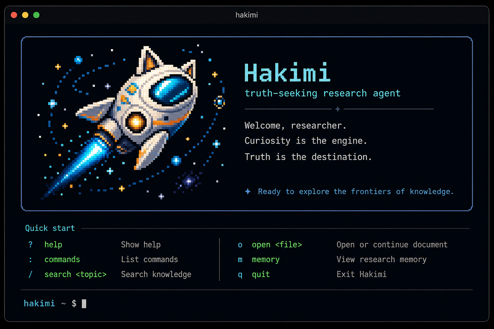
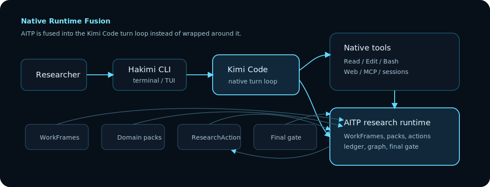
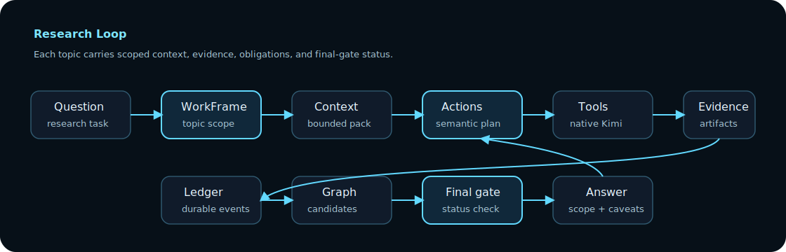

# Hakimi

<p align="center">
  
</p>

<p align="center">
  <strong>Physics agent for exploring the truth of the world.</strong><br />
  <span>Hakimi 是一个原生融入 Kimi Code runtime 的理论物理科研 agent。</span>
</p>

<p align="center">
  <a href="README.md">English</a> |
  <a href="https://github.com/bhjia-phys/Hakimi">Repository</a> |
  <a href="https://moonshotai.github.io/kimi-code/zh/">上游 Kimi Code 文档</a>
</p>

[](LICENSE) [](docs/superpowers/plans/2026-06-02-aitp-agent-runtime-slices-v2.md)

## 理念

Hakimi 这个名字故意保留一点童真。它不是冷冰冰的“真理机器”，也不是把提示词堆得很高的外壳，而是一艘带着猫耳舷翼的小型探索飞船：轻快、好奇、愿意进入未知，但每一步都要带着证据返回。

严肃的部分是它要服务理论物理科研。真实科研对话经常同时触碰论文、推导、代码、benchmark、失败记录、约定选择和长期记忆。Hakimi 的目标不是临时答一句，而是让一个课题在多轮会话中保持自洽：知道自己引用了什么、假设了什么、验证了什么、还有什么不能声称已经完成。

## 为什么存在

Hakimi 不是在 coding agent 外面套一个研究记录本。它是 [MoonshotAI/kimi-code](https://github.com/MoonshotAI/kimi-code) 的 runtime-native fork：终端循环、工具系统、sessions、skills、MCP、subagents、records/replay、permissions、OAuth 路径和包结构在需要兼容的地方继续继承 Kimi Code；理论物理科研系统则通过 `.aitp` 文件、`packages/agent-core`、turn-loop context injection、tool exposure、records、replay 和 model-facing research tools 进入原生 runtime。

这意味着一个科研动作可以搜索文献、读取代码、准备 patch、提交或归一化外部任务回执、捕获证据，并回到正确的 WorkFrame，而不是把不同课题混在一个长 prompt 里。Hakimi 想做的是：让每条研究线索都记得自己知道什么、证据在哪里、哪些约定成立、哪些结论还不能升级为可信记忆。

## 原生融合结构

<p align="center">
  
</p>

## 科研循环

<p align="center">
  
</p>

## 现在已经能做什么

- `hakimi` 是这个包唯一安装的 CLI 命令，因此不会覆盖单独安装的 Kimi Code `kimi` 命令。
- TUI welcome screen 已经使用 Hakimi 像素探索飞船和 physics research 文案。
- WorkFrame 能按 domain、topic、assumptions、conventions、context pack 和 trust state 隔离当前科研问题。
- Domain packs、workflow recipes、physics memory、evals、action bindings 和 tool inventory 可以从 file-backed `.aitp` fixtures 加载。
- ResearchAction 可以执行 in-process graph query、benchmark adapter、formalization blueprint export 和 external job receipt normalization。
- 文献搜索、局部代码 patch 准备、外部 benchmark workflow 通过 Kimi 原生工具编排，而不是塞进 `ResearchAction` 内部直接执行。
- 证据可以写入 research ledger，只在匹配 WorkFrame scope 时重新读取，并被编译成 graph candidates，再经过 harness/final-gate 检查。

## 架构层

Hakimi 围绕五个科研 runtime 层组织。

| 层 | 作用 |
| --- | --- |
| Skills | 程序性记忆：agent 应该怎么工作，例如推导检查、公式到代码 debug、LibRPA 运行准备。 |
| Physics memory capsules | 语义记忆：带 scope、assumptions、provenance、dependency edges、reliability state 和 expansion handles 的物理 claim。 |
| Research ledger | 真实会话中发生过的 source-backed events，在被信任为可复用 memory 之前先进入 ledger。 |
| Compiler and graph | 不是摘要器，而是保留依赖、矛盾标记、验证状态和失败条件的知识编译器。 |
| Research actions | 可审计科研动作，例如约定检查、graph expansion、公式到代码映射、benchmark 验证和 harness 生成。 |

`WorkFrame` 是把这些层连接起来的现场科研状态：它跟踪 active domain、topic、goal、assumptions、conventions、context pack、evidence、obligations 和 final-gate status。Blocking obligations 未关闭时，结论不能被当成 validated memory。

## 与上游的关系

Hakimi 刻意保持贴近上游 Kimi Code。SDK/OAuth imports 和 `.kimi-code` 数据目录目前继续兼容；用户看到的产品名是 `Hakimi`，npm 包名是 `@bhjia-phys/hakimi`，主命令是 `hakimi`。这是一个原生 fork，不是外部 wrapper。

Codex 和 ForgeCode 是参考而不是依赖：Codex 提供 tool exposure、结构化 tool output、action trace 等工程启发；ForgeCode 提供 harness 和可复现 eval workflow 的设计参考。

## 路线图

### 0.0.1: Physics Memory Vertical Slice

第一步是在 `packages/agent-core` 内实现 runtime-native memory 路径：

- 新增 `physics-memory` types、parser、scanner、registry、compiler 和 exports；
- 新增模型可调用的 `PhysicsMemory` builtin tool；
- 支持 `list_domains`、`list_capsules`、`load_capsule`、`compile_context`；
- 让 physics memory 平行于 skills，而不是塞进 skills；
- 用 experimental flag 默认关闭；
- 用一个窄的 LibRPA fixture set 证明形状。

0.0.1 的 schema 已经预留 `graphRefs`、`expansionHandles`、`requiredChecks` 和 `actionAffordances`，这样后续 research-action 层有稳定接口。

### 0.0.2: Research Ledger And ActionAlgebra

- 新增 `research-ledger` 子系统，扫描 `.aitp/research-ledger`，把 source-backed research events 和可信 physics memory 分开；
- 从 ledger events 编译出 candidate capsules、graph refs、obligations 和 harness candidates；
- 把 `ResearchActionRegistry` 扩展为 ActionAlgebra，加入 phase、precondition、effect、generated obligation、validator 和 primitive tool attribution；
- 新增 `WorkFrame`、`ResearchObligation` 和 `ValidationScheduler` 基础；
- 在 experimental flags 后暴露 `ResearchLedger` 和 `ResearchAction` model tools；
- 协调 Kimi primitive tools、Codex-style lifecycle ideas 和 ForgeCode-style harness boundaries，但不替换 Kimi 的 tool manager。

### 0.0.3: Thin Base Runtime Spine

先补一条最小的 Codex-style runtime reliability 脊梁：

- primitive tool lifecycle envelope；
- tool call 到 action/workframe 的归因；
- result status 和 artifact refs；
- diff/output capture 边界；
- 必要的 interruption/background 状态。

这个 slice 不搬 Codex，也不重写 Kimi 的 tool manager。

### 0.0.4: LedgerWriter And Controlled Capture

- 增加 schema-checked `ResearchLedger.write_event`；
- 写入确定性的 `.aitp/research-ledger/<topic>/events/*.md`；
- 第一阶段只捕获高价值的 source、git diff、benchmark 和 failure observations；
- 长输出保存为 artifact refs，避免 ledger 变成噪音堆。

### 0.0.5: WorkFrame And ResearchAction Call Trace

- 让 WorkFrame 成为 active session context；
- 支持打开、切换、列出、关闭 WorkFrame；
- 把 ResearchAction call 和 primitive tool call、ledger event 连接起来；
- 从 action effects 生成 obligations；
- 在多个 research frame 之间保持 domain isolation。

### 0.0.6: LibRPA Micro Vertical Slice

先用一个窄的计算物理工作流证明 runtime spine 真的有用：

```text
formula capsule
-> code mapping
-> git diff / implementation trace
-> smoke benchmark
-> intermediate observable check
-> failure mode or validated memory update
-> harness regression case
```

### 0.0.7: Capsule Boundary Compiler

- 把局部自洽的推导/代码块编译成 candidate capsule；
- 推导内部保持轻量；
- 只有当局部块要连接 memory、graph、final answer 或其他块时，才进入 capsule boundary。

### 0.0.8: PhysicsDirectionEngine And Lenses

- 增加带 applicability check 的 physics lenses，而不是关键词触发；
- 先做 `topological-order/fqhe-cs` 和 `librpa/head-wing` domain packs；
- 增加 charge-flux quantization lens，并明确区分 external electromagnetic flux、emergent Chern-Simons flux 和 quasiparticle AB flux period。

### 0.0.9: EscalationPolicy And Final Gate

- 简单问题保持轻量；
- 代码修改、benchmark、promotion 和高风险理论 claim 自动升级；
- blocking obligations 未关闭时，final answer 不能声称 validated。

### 0.1: Harness And Eval Runner

- 把 failed 或 inconclusive action traces 转成可审查的 harness candidates；
- 把确认后的 candidates 提升为确定性的 eval cases；
- 增加 FQHE/CS reasoning 和 LibRPA head-wing workflows 的端到端 eval。

### 0.2: FQHE/CS Theory Vertical Slice

闭环第一个形式理论切片：围绕 Laughlin wavefunction、flux insertion、charge-flux quantization、Chern-Simons effective theory 和 K-matrix response，实现 capsules、derivation blocks、physics lenses、convention checks 和 final-answer status。

## 当前状态

- 2026-06-03 已刷新并合并 `MoonshotAI/kimi-code:main` 到 commit `6a22523`（`fix: simplify goal budget schema and fix output caps (#365)`），同时保留 AITP runtime 集成。
- AITP Agent 0.0.1 的 physics-memory vertical slice 已经实现，并通过 `KIMI_CODE_EXPERIMENTAL_PHYSICS_MEMORY=1` 默认关闭式启用。
- `packages/agent-core` 现在包含 physics-memory types、parser、scanner、registry、compiler、session scanning、append-only records、模型可调用的 `PhysicsMemory` builtin tool、LibRPA fixture capsules，以及基础版 `ResearchActionRegistry`。
- Windows 环境中 broader `agent-core` suite 的基线失败已经修复；详见 [AITP Agent 0.0.1 Audit](docs/internal/aitp-agent-0.0.1-audit.md)。
- 0.0.2 foundation 已经实现：`research-ledger` types/parser/scanner/registry/compiler、session scanning、append-only records、`ResearchLedger` tool、ActionAlgebra types、默认 research actions、scheduler、`ResearchAction` tool、raw-tool escape records，以及 harness candidate conversion。详见 [AITP Agent 0.0.2 Audit](docs/internal/aitp-agent-0.0.2-audit.md)。
- 0.0.3 已经开始实现 thin primitive tool lifecycle spine：真实 loop 层工具调用现在会写入 `tool_lifecycle.started` 和 `tool_lifecycle.completed` records，包含 status、bounded summaries、timing、cwd，以及后续 WorkFrame/ResearchAction 归因预留槽。详见 [AITP Agent 0.0.3 Audit](docs/internal/aitp-agent-0.0.3-audit.md)。
- 0.0.4 已经开始实现 schema-checked `ResearchLedger.write_event` 和 controlled `capture_event`：紧凑的 source-backed events 可以写入确定性的 `.aitp/research-ledger/<topic>/events/*.md` 路径，立即注册到当前 registry，通过 `research_ledger.event_written` 审计，并经过 source/git-diff/benchmark/failure capture policy 过滤。详见 [AITP Agent 0.0.4 Audit](docs/internal/aitp-agent-0.0.4-audit.md)。
- 0.0.5 已经开始实现 active WorkFrame runtime state 和 ResearchAction call trace：`ResearchAction` 可以打开、切换、列出、关闭 WorkFrames，也可以 start/finish action calls；二者都可以 replay；action result 可以携带 ledger event ids；primitive tool lifecycle records 现在会携带 active `workFrameId` 和 `actionCallId`。详见 [AITP Agent 0.0.5 Audit](docs/internal/aitp-agent-0.0.5-audit.md)。
- 0.0.6 已经开始实现 LibRPA head-wing micro vertical slice：绑定到 LibRPA workflow intent 的通用 code/benchmark actions、CI-safe head-wing smoke benchmark stand-in、scheduler expectations、controlled failure capture 和 harness candidate conversion。详见 [AITP Agent 0.0.6 Audit](docs/internal/aitp-agent-0.0.6-audit.md)。
- 0.0.7 已经开始实现 capsule boundary compiler：局部自洽的 `ResearchBlock` 可以编译成未提升的 `PhysicsCapsule` candidate，并保留 assumptions、conventions、source refs、open questions 和 required checks。详见 [AITP Agent 0.0.7 Audit](docs/internal/aitp-agent-0.0.7-audit.md)。
- 0.0.8 已经开始实现 PhysicsDirectionEngine 和带 applicability check 的 physics lenses：FQHE/CS 的 charge-flux quantization、LibRPA head-wing 的 formula-code mapping 现在可以被推荐、拒绝并审计，输出 caveats、guiding questions、required checks 和结构化 ResearchAction bindings。详见 [AITP Agent 0.0.8 Audit](docs/internal/aitp-agent-0.0.8-audit.md)。
- 0.0.9 已经开始实现 EscalationPolicy 和 Final Gate：简单物理问题保持轻量，代码、benchmark、高风险理论 claim 和 promotion 会升级到必要的 runtime controls；当 blocking obligations 仍然打开时，validated final claim 会被降级或阻断。详见 [AITP Agent 0.0.9 Audit](docs/internal/aitp-agent-0.0.9-audit.md)。
- 0.1 已经开始实现 Harness 和 Eval Runner：failed/inconclusive action traces 可以转成确定性的 eval cases；eval run 可以检查 action sequence、action outcomes、evidence refs 和 required checks。详见 [AITP Agent 0.1 Audit](docs/internal/aitp-agent-0.1-audit.md)。
- 0.2 已经开始实现可执行的 FQHE/CS theory vertical slice：Laughlin wavefunction、flux insertion、Abelian CS action 和 K-matrix response blocks 可以编译成 candidate capsules，经过 charge-flux lens/convention checks，生成 eval case，并进入 final gate。详见 [AITP Agent 0.2 Audit](docs/internal/aitp-agent-0.2-audit.md)。
- 0.2.1 upstream sync guardrail 已经配置本地 Kimi Code `upstream` remote；后续重试已经成功合并 `upstream/main` 的 `7ffb5dd`，并保留 AITP runtime 扩展。详见 [Upstream Sync 2026-06-02](docs/internal/upstream-sync-2026-06-02.md)。
- 0.2.2 已经把 research actions 重构为 universal ids 加结构化 `ResearchActionBinding`：FQHE/CS charge-flux check 现在绑定到 `validate.check_convention` 和 charge-flux `checkId`；LibRPA head-wing benchmark 现在绑定到 `benchmark.run_minimal_case` 和 LibRPA adapter id。详见 [AITP Agent 0.2.2 Audit](docs/internal/aitp-agent-0.2.2-audit.md)。
- 0.2.3 已经加入 file-backed `DomainProfile` 和 `WorkflowRecipe` registries，通过 `KIMI_CODE_EXPERIMENTAL_DOMAIN_PROFILE` 和 `KIMI_CODE_EXPERIMENTAL_WORKFLOW_RECIPE` 开启，扫描 `.aitp/domain-profiles` 和 `.aitp/workflow-recipes` 并暴露为 `agent.domainProfiles` 和 `agent.workflowRecipes`。详见 [AITP Agent 0.2.3 Audit](docs/internal/aitp-agent-0.2.3-audit.md)。
- 0.2.5 已经加入第一版 WorkFrame ContextPack orchestrator：active WorkFrame 可以从 DomainProfile、WorkflowRecipe、PhysicsMemory、ResearchLedger 和 action bindings 编译 bounded `ResearchContextPack` summary，并把 pack id 绑定回 WorkFrame 用于 replay 和审计。详见 [AITP Agent 0.2.5 Audit](docs/internal/aitp-agent-0.2.5-audit.md)。
- 0.2.6 已经开始闭合 turn loop：prompt-sensitive 的 WorkFrame 复用/切换现在会在 injection cycle 里发生，系统会为推断出的 active WorkFrame 重新编译 bounded `ResearchContextPack`，并在 research step 之前把一个紧凑的 AITP research-context reminder 注入到 model-facing context。详见 [AITP Agent 0.2.6 Audit](docs/internal/aitp-agent-0.2.6-audit.md)。
- 0.2.7 已经开始动态工具暴露：当 research turn 已经拿到 bounded `ResearchContextPack` 之后，runtime 可以施加一个临时 managed-tool overlay，使 theory-oriented turn 保留语义研究工具，而 code-oriented turn 额外暴露 `Bash` / `Write` / `Edit`。详见 [AITP Agent 0.2.7 Audit](docs/internal/aitp-agent-0.2.7-audit.md)。
- 0.2.8 已经开始受控自动捕获：`tool_lifecycle.completed` 现在可以结合 active `WorkFrame` 自动识别真实工具结果，把 git diff / benchmark / failure / source excerpt 压缩写入 `.aitp/research-ledger`，同时为低价值工具噪音留下明确的 skip reason 审计记录。详见 [AITP Agent 0.2.8 Audit](docs/internal/aitp-agent-0.2.8-audit.md)。
- 0.2.9 已经开始 graph-aware memory compilation：research-ledger events 现在可以编译成 typed graph candidates，并附带 provenance check、dependency diagnostics、assumption trace 和 incompatible convention warning；这些输出仍然保持 candidate-level，不会静默变成 canonical memory。详见 [AITP Agent 0.2.9 Audit](docs/internal/aitp-agent-0.2.9-audit.md)。
- 0.3.0 已经开始 promotion pipeline 和 trust-ladder gate：graph candidates 现在只能通过显式 `PhysicsPromotionPacket` 才能晋升，source refs、scope、validation refs 以及 formalized 所需的人类 checkpoint 都会被严格检查；晋升后的 capsule 会保留 trust metadata，而不是抹掉 promotion path。详见 [AITP Agent 0.3.0 Audit](docs/internal/aitp-agent-0.3.0-audit.md)。
- 0.3.1 已经开始 final-gate lifecycle integration：当一个 research turn 试图结束，但 active `WorkFrame` 仍然没有通过 final gate 时，runtime 现在会注入一条非常短的 final-gate continuation 提示，并强制模型再走一步，把答案降级成更保守的表述，而不是静默过度宣称完成。详见 [AITP Agent 0.3.1 Audit](docs/internal/aitp-agent-0.3.1-audit.md)。
- 0.4.0 到 0.10.0 已经补齐 Harness V2、LibRPA/FQHE file-backed verticals、bridge-gated domain isolation、physics graph kernel、formalization bridge，以及图查询、benchmark adapter 和 formalization blueprint 的 in-process `ResearchAction` executor lane。
- 0.11.0 已经开始 primitive tool plan templates 和 live native-tool orchestration：每个默认 `ResearchAction` 都可以渲染可审计的原生工具计划；文献搜索、局部代码 patch 准备、外部 benchmark job 提交都有一等语义 action。Runtime tool exposure 会读取 action bindings，通过 turn-scoped Kimi tool builder 激活模板所需的 Kimi 原生工具，并且 replay 后保持 topic-scoped overlay 和 evidence attribution 不串会话；`ResearchAction` 本身仍然不直接执行 shell、git、web、MCP 或 HPC。整轮测试现在已经覆盖 source search、code patch、external job submission，并通过原生 `WebSearch`/`FetchURL`、`Read`/`Edit`、`Bash` 和 `ResearchLedger.capture_event` 的 call attribution 回填到 `ResearchAction.finish_action_call`，同时写入 durable source/code/job ledger event、发出 `research_ledger.event_written`，并把 `ledger:event...` id 放进 `evidence_refs`。详见 [AITP Agent 0.11.0 Audit](docs/internal/aitp-agent-0.11.0-audit.md)。
- 0.11.1 已经加入第一版 external job submission adapter contract：`adapter.external.job-submission` 可以把 scheduler/MCP/HPC/manual job receipt 归一化成 `benchmark.submit_external_job` 的 `BenchmarkAdapterRunResult`，但不在 `ResearchAction` 内执行调度器。Primitive plan 现在会在原生提交之后、ledger/action 记录之前加入 adapter normalization 步骤。详见 [AITP Agent 0.11.1 Audit](docs/internal/aitp-agent-0.11.1-audit.md)。
- 0.11.2 已经把 WorkFrame-scoped evidence inspection 加入 `ResearchAction`：模型可以列出 active 或显式 WorkFrame 最近动作产生的 evidence refs，并且只能在 ledger metadata 匹配当前 frame 的 domain/topic 时加载 `ledger:event...` 正文。加载会写入 `research_ledger.event_loaded`；跨课题/跨 domain 加载会在渲染正文前失败。详见 [AITP Agent 0.11.2 Audit](docs/internal/aitp-agent-0.11.2-audit.md)。
- 0.11.3 已经让 external-job receipt lane 更适合原生工具输出：`adapter.external.job-submission` 现在可以从 SLURM、LSF、SGE、PBS/qsub 等常见 scheduler output 中保守解析 job id，同时拒绝任意 shell 输出。这样 Bash/MCP/remote-runner 只要返回清晰调度器回执，就能用 `schedulerOutput` 喂给 adapter。详见 [AITP Agent 0.11.3 Audit](docs/internal/aitp-agent-0.11.3-audit.md)。
- 0.12.0 已经加入 file-backed `DomainPackManifest` runtime summary：`ResearchContextPack` 现在会携带当前 domain 的 profile/workflow/memory/eval/action/tool inventory，context reminder 和 `ResearchAction` 渲染都会暴露这个 manifest；runtime tool exposure 不再因为 domain 是 LibRPA 就自动打开代码工具。代码工具现在只来自 file-backed workflow `required_tools`、DomainPack action ids 或 universal action primitive plan。FQHE/CS 与 LibRPA fixture 测试会断言 eval、capsule 和 tool exposure 互相隔离，除非存在显式 bridge capsule。详见 [AITP Agent 0.12.0 Audit](docs/internal/aitp-agent-0.12.0-audit.md)。
- 0.12.1 已经收紧原生科研 runtime：`ResearchAction.inspect_domain_pack` 可以检查 active 或显式 ContextPack 的 DomainPack manifest；active WorkFrame 中未挂接 active `ResearchAction` call 的原生工具使用现在会写入带 `workFrameId` 和建议 follow-up action 的 `research_action.raw_tool_escape`；旧的硬编码 vertical exports 也被标记为 compatibility-only，推荐使用 file-backed `.aitp` domain packs。
- 截至 0.12.1，当前 baseline 已经是 file-backed、graph-aware、bridge-gated、带审计和恢复测试的科研 runtime；graph、benchmark、formalization、external-job receipt lane 都有确定性 research executor，literature、code、external benchmark workflow 能通过 Kimi 原生工具执行并留下 durable ledger evidence refs。topic pack 现在有 manifest 级别的 profile/workflow/memory/eval/action/tool summary、primitive tool call attribution、WorkFrame-scoped evidence reread、保守的原生 scheduler 回执归一化，以及 raw primitive tool escape 的恢复记录。

## 本地开发

环境要求继承自上游 Kimi Code runtime：

- Node.js `>=24.15.0`
- pnpm `10.33.0`

从本 fork 构建一个本地可安装的 CLI 包：

```powershell
corepack pnpm --config.engine-strict=false install
corepack pnpm --config.engine-strict=false build
New-Item -ItemType Directory -Force dist-pack
corepack pnpm --config.engine-strict=false -C apps/kimi-code pack --pack-destination ..\..\dist-pack
npm install -g .\dist-pack\bhjia-phys-hakimi-0.8.0.tgz
hakimi --version
hakimi
```

如果不想影响全局 npm prefix，可以做隔离安装检查：

```powershell
$prefix = "$PWD\.sisyphus\drafts\_scratch\hakimi-install-prefix"
npm install --prefix $prefix .\dist-pack\bhjia-phys-hakimi-0.8.0.tgz
& "$prefix\node_modules\.bin\hakimi.cmd" --version
```

按需在科研终端中启用 AITP runtime features：

```powershell
$env:KIMI_CODE_EXPERIMENTAL_PHYSICS_MEMORY = "1"
$env:KIMI_CODE_EXPERIMENTAL_RESEARCH_LEDGER = "1"
$env:KIMI_CODE_EXPERIMENTAL_RESEARCH_ACTION = "1"
$env:KIMI_CODE_EXPERIMENTAL_DOMAIN_PROFILE = "1"
$env:KIMI_CODE_EXPERIMENTAL_WORKFLOW_RECIPE = "1"
$env:KIMI_CODE_EXPERIMENTAL_RESEARCH_HARNESS = "1"
hakimi
```

```sh
pnpm install
pnpm dev:cli
pnpm test
pnpm typecheck
pnpm lint
pnpm build
```

0.0.1 工作的聚焦验证命令：

```sh
pnpm vitest run packages/agent-core/test/physics-memory packages/agent-core/test/tools/physics-memory-tool.test.ts
pnpm --filter @moonshot-ai/agent-core test
pnpm --filter @moonshot-ai/agent-core typecheck
```

0.0.2 工作的聚焦验证命令：

```sh
pnpm vitest run packages/agent-core/test/research-ledger packages/agent-core/test/research-action packages/agent-core/test/tools/research-ledger-tool.test.ts packages/agent-core/test/tools/research-action-tool.test.ts
pnpm --filter @moonshot-ai/agent-core test
pnpm --filter @moonshot-ai/agent-core typecheck
```

0.0.3 primitive tool lifecycle 工作的聚焦验证命令：

```sh
pnpm vitest run packages/agent-core/test/agent/tool-lifecycle.test.ts packages/agent-core/test/agent/basic.test.ts
pnpm --filter @moonshot-ai/agent-core typecheck
pnpm exec oxlint packages/agent-core/src/agent/tool-lifecycle/index.ts packages/agent-core/src/agent/index.ts packages/agent-core/src/agent/turn/index.ts packages/agent-core/src/agent/records/types.ts packages/agent-core/src/agent/records/index.ts packages/agent-core/test/agent/tool-lifecycle.test.ts packages/agent-core/test/agent/harness/snapshots.ts
```

0.0.4 research ledger writer 工作的聚焦验证命令：

```sh
pnpm vitest run packages/agent-core/test/research-ledger/writer.test.ts packages/agent-core/test/research-ledger/capture-policy.test.ts packages/agent-core/test/tools/research-ledger-tool.test.ts packages/agent-core/test/research-ledger
pnpm --filter @moonshot-ai/agent-core typecheck
pnpm exec oxlint packages/agent-core/src/research-ledger/writer.ts packages/agent-core/src/research-ledger/capture-policy.ts packages/agent-core/src/research-ledger/index.ts packages/agent-core/src/research-ledger/registry.ts packages/agent-core/src/agent/research-ledger/index.ts packages/agent-core/src/tools/builtin/collaboration/research-ledger-tool.ts packages/agent-core/test/research-ledger/writer.test.ts packages/agent-core/test/research-ledger/capture-policy.test.ts packages/agent-core/test/tools/research-ledger-tool.test.ts
```

0.0.5 WorkFrame runtime 工作的聚焦验证命令：

```sh
pnpm vitest run packages/agent-core/test/agent/workframe.test.ts packages/agent-core/test/tools/research-action-tool.test.ts packages/agent-core/test/agent/tool-lifecycle.test.ts packages/agent-core/test/research-action/harness.test.ts
pnpm --filter @moonshot-ai/agent-core typecheck
pnpm exec oxlint packages/agent-core/src/research-action/types.ts packages/agent-core/src/agent/records/types.ts packages/agent-core/src/agent/records/index.ts packages/agent-core/src/agent/research-action/index.ts packages/agent-core/src/agent/turn/index.ts packages/agent-core/src/tools/builtin/collaboration/research-action-tool.ts packages/agent-core/test/tools/research-action-tool.test.ts packages/agent-core/test/agent/tool-lifecycle.test.ts packages/agent-core/test/agent/workframe.test.ts packages/agent-core/test/research-action/harness.test.ts
```

0.0.6 LibRPA micro slice 的聚焦验证命令：

```sh
pnpm vitest run packages/agent-core/test/integration/librpa-head-wing.test.ts packages/agent-core/test/research-action/scheduler.test.ts packages/agent-core/test/tools/research-action-tool.test.ts
pnpm --filter @moonshot-ai/agent-core typecheck
pnpm exec oxlint packages/agent-core/src/research-action/librpa-head-wing.ts packages/agent-core/src/research-action/default-actions.ts packages/agent-core/src/research-action/index.ts packages/agent-core/test/integration/librpa-head-wing.test.ts
```

0.0.7 capsule boundary compiler 的聚焦验证命令：

```sh
pnpm vitest run packages/agent-core/test/research-block/compiler.test.ts
pnpm --filter @moonshot-ai/agent-core typecheck
pnpm exec oxlint packages/agent-core/src/research-block packages/agent-core/src/index.ts packages/agent-core/test/research-block/compiler.test.ts
```

0.0.8 physics direction engine 的聚焦验证命令：

```sh
pnpm vitest run packages/agent-core/test/physics-direction/lens.test.ts packages/agent-core/test/research-action/default-actions.test.ts
pnpm --filter @moonshot-ai/agent-core typecheck
pnpm exec oxlint packages/agent-core/src/physics-direction packages/agent-core/src/research-action/default-actions.ts packages/agent-core/src/index.ts packages/agent-core/test/physics-direction/lens.test.ts packages/agent-core/test/research-action/default-actions.test.ts
```

0.0.9 escalation policy 和 final gate 的聚焦验证命令：

```sh
pnpm vitest run packages/agent-core/test/research-policy packages/agent-core/test/physics-direction/lens.test.ts packages/agent-core/test/research-action/obligation.test.ts
pnpm --filter @moonshot-ai/agent-core typecheck
pnpm exec oxlint packages/agent-core/src/research-policy packages/agent-core/src/index.ts packages/agent-core/test/research-policy
```

0.1 harness 和 eval runner 的聚焦验证命令：

```sh
pnpm vitest run packages/agent-core/test/research-harness/runner.test.ts packages/agent-core/test/research-action/harness.test.ts
pnpm --filter @moonshot-ai/agent-core typecheck
pnpm exec oxlint packages/agent-core/src/research-harness packages/agent-core/src/index.ts packages/agent-core/test/research-harness/runner.test.ts
```

0.2 FQHE/CS vertical slice 的聚焦验证命令：

```sh
pnpm vitest run packages/agent-core/test/physics-verticals/fqhe-cs.test.ts packages/agent-core/test/physics-direction/lens.test.ts packages/agent-core/test/research-harness/runner.test.ts
pnpm --filter @moonshot-ai/agent-core typecheck
pnpm exec oxlint packages/agent-core/src/physics-verticals packages/agent-core/src/index.ts packages/agent-core/test/physics-verticals/fqhe-cs.test.ts
```

0.2.5 WorkFrame ContextPack orchestrator 的聚焦验证命令：

```sh
corepack pnpm --config.engine-strict=false vitest run packages/agent-core/test/research-context packages/agent-core/test/agent/research-context.test.ts packages/agent-core/test/tools/research-action-tool.test.ts packages/agent-core/test/agent/workframe.test.ts
corepack pnpm --config.engine-strict=false --filter @moonshot-ai/agent-core typecheck
```

0.2.6 turn-loop context closure 第一阶段的聚焦验证命令：

```sh
corepack pnpm --config.engine-strict=false vitest run packages/agent-core/test/agent/research-context.test.ts packages/agent-core/test/agent/workframe.test.ts
corepack pnpm --config.engine-strict=false --filter @moonshot-ai/agent-core typecheck
```

0.2.7 dynamic tool exposure 第一阶段的聚焦验证命令：

```sh
corepack pnpm --config.engine-strict=false vitest run packages/agent-core/test/agent/tool-exposure.test.ts packages/agent-core/test/agent/research-context.test.ts packages/agent-core/test/agent/workframe.test.ts
corepack pnpm --config.engine-strict=false --filter @moonshot-ai/agent-core typecheck
```

0.11.0 primitive tool plan template slice 的聚焦验证命令：

```sh
corepack pnpm --config.engine-strict=false vitest run packages/agent-core/test/research-action/primitive-plan.test.ts packages/agent-core/test/research-action/default-actions.test.ts packages/agent-core/test/research-action/records.test.ts packages/agent-core/test/tools/research-action-tool.test.ts packages/agent-core/test/agent/tool-exposure.test.ts packages/agent-core/test/agent/research-context.test.ts packages/agent-core/test/agent/research-action-orchestration.test.ts packages/agent-core/test/loop/hooks.e2e.test.ts
corepack pnpm --config.engine-strict=false vitest run packages/agent-core/test/agent/research-action-orchestration.test.ts packages/agent-core/test/research-action/primitive-plan.test.ts packages/agent-core/test/research-action/default-actions.test.ts packages/agent-core/test/tools/research-action-tool.test.ts packages/agent-core/test/tools/research-ledger-tool.test.ts packages/agent-core/test/agent/tool-exposure.test.ts
corepack pnpm --config.engine-strict=false --filter @moonshot-ai/agent-core typecheck
corepack pnpm --config.engine-strict=false exec oxlint packages/agent-core/src/loop/types.ts packages/agent-core/src/loop/index.ts packages/agent-core/src/loop/run-turn.ts packages/agent-core/src/loop/turn-step.ts packages/agent-core/src/agent/turn/index.ts packages/agent-core/src/agent/tool/index.ts packages/agent-core/src/research-action/primitive-plan.ts packages/agent-core/src/research-action/default-actions.ts packages/agent-core/src/research-action/index.ts packages/agent-core/src/agent/tool-exposure/index.ts packages/agent-core/src/agent/workframe/context-pack.ts packages/agent-core/src/tools/builtin/collaboration/research-action-tool.ts packages/agent-core/src/tools/builtin/collaboration/research-action-tool.md packages/agent-core/test/loop/hooks.e2e.test.ts packages/agent-core/test/loop/api-shape.e2e.test.ts packages/agent-core/test/agent/harness/agent.ts packages/agent-core/test/agent/research-action-orchestration.test.ts packages/agent-core/test/agent/turn.test.ts packages/agent-core/test/research-action/primitive-plan.test.ts packages/agent-core/test/research-action/default-actions.test.ts packages/agent-core/test/research-action/records.test.ts packages/agent-core/test/tools/research-action-tool.test.ts packages/agent-core/test/agent/tool-exposure.test.ts packages/agent-core/test/agent/research-context.test.ts
```

0.11.1 external job submission adapter-contract slice 的聚焦验证命令：

```sh
corepack pnpm --config.engine-strict=false vitest run packages/agent-core/test/benchmark-adapter/external-job-submission.test.ts packages/agent-core/test/research-action/primitive-plan.test.ts packages/agent-core/test/tools/research-action-tool.test.ts
corepack pnpm --config.engine-strict=false --filter @moonshot-ai/agent-core typecheck
corepack pnpm --config.engine-strict=false exec oxlint packages/agent-core/src/benchmark-adapter/external-job-submission.ts packages/agent-core/src/benchmark-adapter/default-adapters.ts packages/agent-core/src/benchmark-adapter/index.ts packages/agent-core/src/research-action/primitive-plan.ts packages/agent-core/test/benchmark-adapter/external-job-submission.test.ts packages/agent-core/test/research-action/primitive-plan.test.ts packages/agent-core/test/tools/research-action-tool.test.ts
```

0.11.2 WorkFrame-scoped evidence inspection slice 的聚焦验证命令：

```sh
corepack pnpm --config.engine-strict=false vitest run packages/agent-core/test/tools/research-action-tool.test.ts
corepack pnpm --config.engine-strict=false --filter @moonshot-ai/agent-core typecheck
corepack pnpm --config.engine-strict=false exec oxlint packages/agent-core/src/agent/research-action/index.ts packages/agent-core/src/tools/builtin/collaboration/research-action-tool.ts packages/agent-core/src/tools/builtin/collaboration/research-action-tool.md packages/agent-core/test/tools/research-action-tool.test.ts
```

0.11.3 external-job native receipt inference slice 的聚焦验证命令：

```sh
corepack pnpm --config.engine-strict=false vitest run packages/agent-core/test/benchmark-adapter/external-job-submission.test.ts packages/agent-core/test/tools/research-action-tool.test.ts
corepack pnpm --config.engine-strict=false --filter @moonshot-ai/agent-core typecheck
corepack pnpm --config.engine-strict=false exec oxlint packages/agent-core/src/benchmark-adapter/external-job-submission.ts packages/agent-core/test/benchmark-adapter/external-job-submission.test.ts packages/agent-core/test/tools/research-action-tool.test.ts
```

0.12.0 file-backed DomainPack runtime 的聚焦验证命令：

```sh
corepack pnpm --config.engine-strict=false vitest run packages/agent-core/test/domain-pack/compiler.test.ts packages/agent-core/test/research-context/compiler.test.ts packages/agent-core/test/agent/tool-exposure.test.ts packages/agent-core/test/physics-verticals/librpa.test.ts packages/agent-core/test/physics-verticals/fqhe-cs-v2.test.ts
corepack pnpm --config.engine-strict=false --filter @moonshot-ai/agent-core typecheck
corepack pnpm --config.engine-strict=false exec oxlint packages/agent-core/src/domain-pack packages/agent-core/src/research-context/compiler.ts packages/agent-core/src/research-context/types.ts packages/agent-core/src/agent/research-context/index.ts packages/agent-core/src/agent/tool-exposure/index.ts packages/agent-core/src/agent/workframe/context-pack.ts packages/agent-core/src/tools/builtin/collaboration/research-action-tool.ts packages/agent-core/test/domain-pack/compiler.test.ts packages/agent-core/test/research-context/compiler.test.ts packages/agent-core/test/agent/tool-exposure.test.ts packages/agent-core/test/physics-verticals/librpa.test.ts packages/agent-core/test/physics-verticals/fqhe-cs-v2.test.ts
```

仓库工作规则：

- 每完成一个 coherent runtime change，都应该先提交 commit，再进入下一块；
- 当项目目标、feature 状态、安装验证方式或用户可见行为变化时，同步更新 `README.md` 和 `README.zh-CN.md`。

## 许可证

基于 [MIT](LICENSE) 协议发布。
